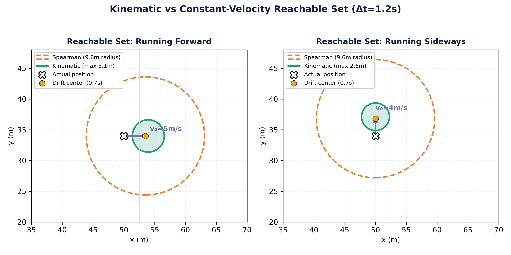
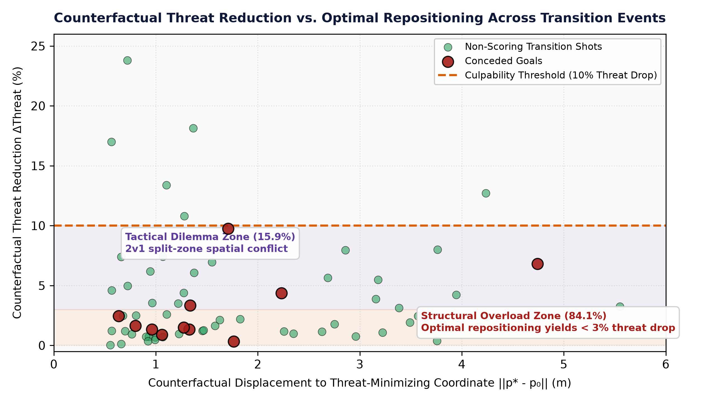

# K-PACE

**Kinematically-Constrained Pitch-control Attribution for Counterfactual Error**

Reference implementation and replication code for:
> **Closing the Blame Gap: Kinematically-Constrained Counterfactual Pitch Control for Defensive Error Attribution in Soccer**  

## Overview

K-PACE evaluates defensive positioning during transition phases by constraining counterfactual spatial models with realistic human biomechanics: neuromuscular reaction latency ($t_{\text{react}} = 0.7\text{ s}$), sprint acceleration limits ($a_{\max} = 4.5\text{ m/s}^2$), and velocity ceilings ($v_{\max} = 8.0\text{ m/s}$). 

By optimizing a recovering defender's position against spatial transition threat within their reachable boundary, the framework determines whether an attacking opportunity resulted from an individual positional error or an unpreventable structural overload following turnover.

<p align="center">
  
</p>

<p align="center">
  
</p>

---

## Repository Structure

```
k-pace/
├── data/
│   ├── README.md                  # Dataset documentation & provenance
│   └── batch_analysis_results.json # Pre-computed metrics for 69 transition events
├── figures/
│   ├── reachable_set_comparison.png
│   └── all_transitions_threat_reduction.png
├── src/
│   └── kpace/
│       ├── assets/
│       │   └── ma2024.xlsx        # Expected threat (xT) transition surface
│       ├── __init__.py
│       ├── config.py              # Physical constants & grid parameters
│       ├── kinematic_pitch_optimizer.py # Core counterfactual optimizer
│       └── load_metrica.py        # 25 Hz tracking data loader (kloppy)
├── download_metrica.py            # Automated downloader for Metrica Games 1–3
├── reproduce_figures.py           # Generates Figures 1 and 2 from dataset
├── requirements.txt               # Dependencies
├── LICENSE                        # MIT License
└── README.md
```

---

## Installation

Requires Python 3.10+.

```bash
git clone https://github.com/azadmancha/k-pace.git
cd k-pace
pip install -r requirements.txt
```

---

## Reproducing Figures

To regenerate Figures 1 and 2 from the paper using the included transition dataset:

```bash
python reproduce_figures.py
```

This outputs:
- `figures/reachable_set_comparison.png` (Figure 1: Reachable Set Comparison)
- `figures/all_transitions_threat_reduction.png` (Figure 2: Empirical Threat Reduction vs. Displacement)

---

## Python API Usage

```python
import sys
sys.path.insert(0, "src")
from kpace import KinematicPitchOptimizer

optimizer = KinematicPitchOptimizer()

# Define player states: [{'pos': [x, y], 'vel': [vx, vy]}]
attackers = [{"pos": [78.0, 30.0], "vel": [5.5, 1.2]}, {"pos": [92.0, 36.0], "vel": [6.8, -0.5]}]
defenders = [{"pos": [102.0, 34.0], "vel": [0.0, 0.0]}, {"pos": [84.0, 38.0], "vel": [4.0, 2.5]}]

# Optimize target defender positioning over a 1.0s counterfactual horizon
res = optimizer.optimize_defender_position(attackers, defenders, target_defender_idx=1, delta_t=1.0)
print(f"Optimal position p*: {res['optimal_position']}")
print(f"Counterfactual threat reduction: {res['threat_reduction_pct']:.1f}%")
```

---

## Data

The pre-computed transition dataset (`data/batch_analysis_results.json`) contains metrics for all 69 counterattack transition events (11 conceded goals, 58 non-scoring shots) analyzed in the paper.

To download the raw 25 Hz tracking files from the [Metrica Sports open repository](https://github.com/metrica-sports/sample-data):

```bash
python download_metrica.py
```

See [`data/README.md`](data/README.md) for details on coordinates and data provenance.

---

## License

This project is licensed under the [MIT License](LICENSE).  
Metrica Sports sample tracking data is governed by the [Metrica Sports Terms of Use](https://github.com/metrica-sports/sample-data).
